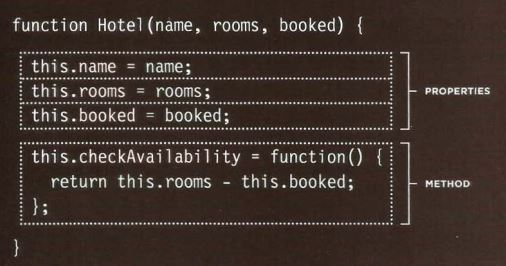
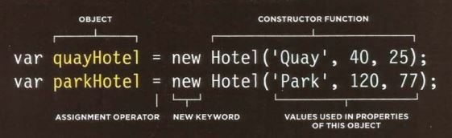
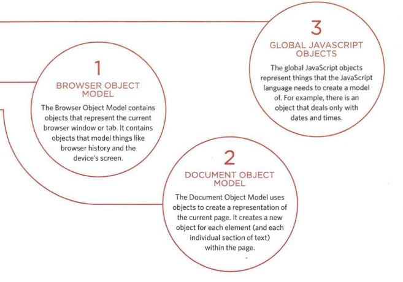

## Tables in HTML

| Tag or Attribute  |    Meaning    |                                                 Use                                                 |
|-------------------|---------------|-----------------------------------------------------------------------------------------------------|
|  ***< table >***  | Table         | Create a table, the contents of the table are written out row by row                                |
|  ***< thead >***  | Table Head    | Indicate the headings of the table                                                                  |
|  ***< tbody >***  | Table Body    | Indicate the body of the table                                                                      |
|  ***< tfoot >***  | Table Footer  | Indicate the footer of the table                                                                    |
|   ***< tr >***    | Table Row     | Indicate the start of each row of the table                                                         |
|   ***< td >***    | Table Data    | Represent each cell of a table, used inside **< tr >**                                              |
|   ***< th >***    | Table Heading | represent the heading for either a column or a row, used inside **< tr >**                          |
|                   |               |                                                                                                     |
|  Scope attribute  | Heading Scope | Indicate whether it is a heading for a column or a row (values: row or col), used inside **< th >** |
| Colspan attribute | Column Span   | Indicate how many columns that cell should run across, used inside **< th >** or **< td >**         |
| Rowspan attribute | Row Span      | Indicate how many rows that cell should span down the table, used inside **< th >** or **< td >**   |

# Objects in JavaScript

### Constructor Notation

**The object constructor function** is part of JavaScript language and used to create a **blank object**, then can add properties and methods to it using dot notation

*var hotel = new Object();*

Object instructor can use a function as a template for creating several objects that represent similar things

Objects created with literal notation are good:
* When storing/transmitting data between applications
* For global or configuration objects that set up information for the page

Objects created with constructors are good:
* When having lots of objects used with similar functionality 
* When a complex object might not be used in code

**Arrays** are actually a special type of object, they hold a related set of key/value pairs (like all objects), but the key for each value is its index number

### Built-in Objects

**Object Model**: A group of objects, each of which represents related things from the real world, together they form a model of something larger

